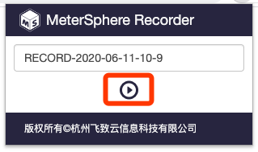
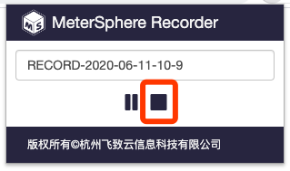
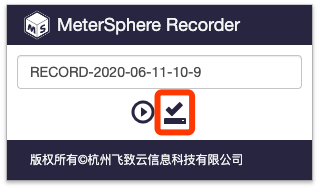
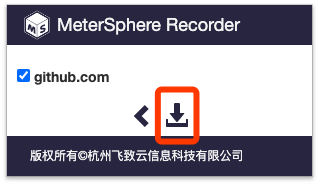

# MeterSphere 浏览器插件

[MeterSphere](https://github.com/metersphere/metersphere) 是一站式的开源企业级持续测试平台，涵盖测试跟踪、接口测试、性能测试、团队协作等功能，兼容JMeter 等开源标准，有效助力开发和测试团队充分利用云弹性进行高度可扩展的自动化测试，加速高质量软件的交付。
该项目为 MeterSphere 配套的浏览器插件，该插件可将用户在浏览器操作时的 HTTP 请求记录下来并生成 JMX 文件（JMeter 脚本文件），用于在 MeterSphere 中进行接口测试或性能测试。

## 安装使用

### Chrome 应用商店安装

https://chrome.google.com/webstore/detail/metersphere/dfikodepgdmofjbffdhpakgkachehgdj

### 开发者模式安装
  1. 谷歌浏览器输入chrome://extensions/ 进入扩展程序安装界面，打开开发者模式
  2. 导入扩展程序以下两种方式
     - git clone 该项目到本地，选择「加载已解压的扩展程序」选择该项目目录进行安装
     - 在该项目的 [release](https://github.com/metersphere/chrome-extensions/releases) 页面下载最新版本的 zip 包，将 zip 包拖到浏览器扩展程序页面进行安装

### 使用指导

插件安装后，点击浏览器插件列表中该插件图标，在弹出页面中可以修改录制脚本的名称，点击开始录制按钮

访问需要进行录制的站点，进行正常使用操作，浏览器中的所有网络请求均会被记录下来

当操作完成后，点击插件界面的停止按钮停止录制

录制停止后，点击插件界面的保存按钮进行保存

插件弹出所有记录到请求的站点列表，勾选需要保留的站点请求点击下载按钮，下载 JMX 脚本至本地

## 了解更多

- [MeterSphere 官网](https://metersphere.io)
- [MeterSphere 文档](https://metersphere.io/docs)
- [演示视频](https://metersphere.oss-cn-hangzhou.aliyuncs.com/metersphere_demo.mp4)
  
## 微信群

## License & Copyright

Copyright (c) 2014-2020 飞致云 FIT2CLOUD, All rights reserved.

Licensed under The GNU General Public License version 2 (GPLv2)  (the "License"); you may not use this file except in compliance with the License. You may obtain a copy of the License at

https://www.gnu.org/licenses/gpl-2.0.html

Unless required by applicable law or agreed to in writing, software distributed under the License is distributed on an "AS IS" BASIS, WITHOUT WARRANTIES OR CONDITIONS OF ANY KIND, either express or implied. See the License for the specific language governing permissions and limitations under the License.
